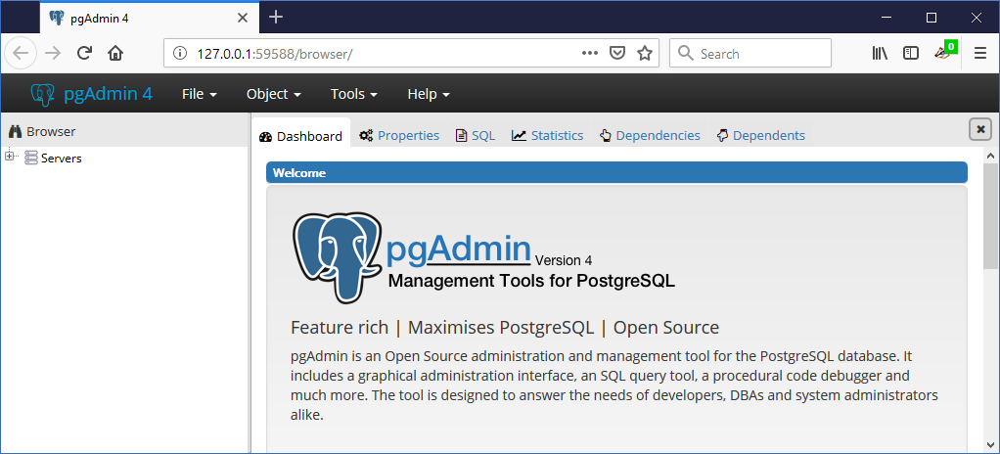
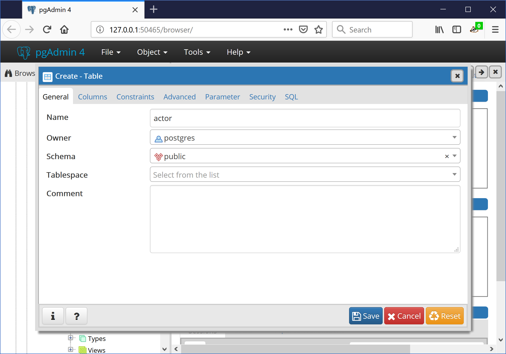
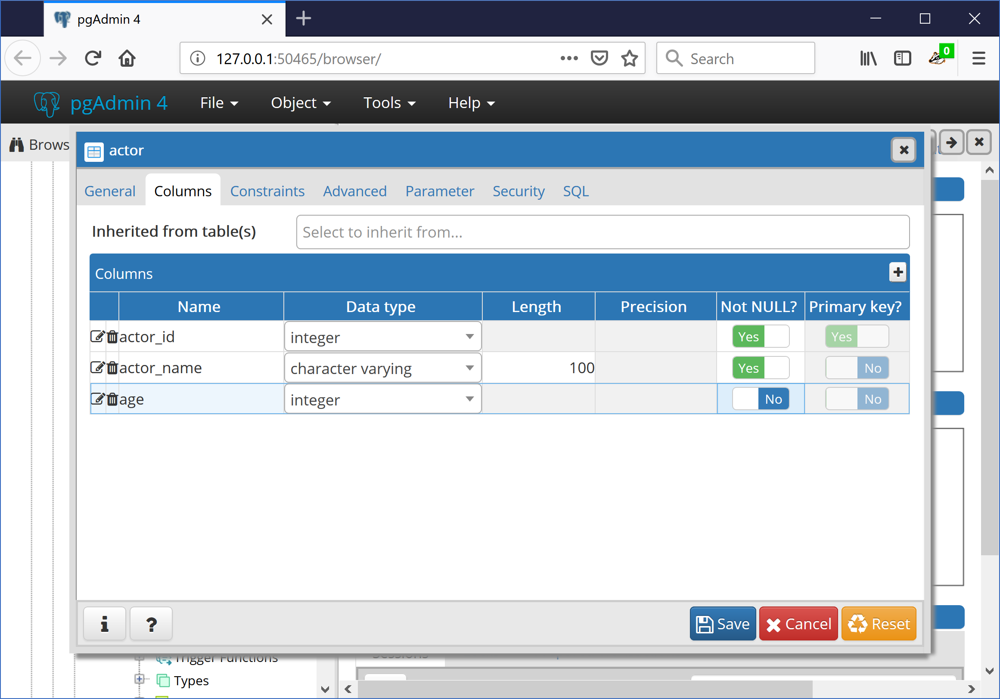

GUI Based Development
=====================

The approach uses a GUI, such as pgAdmin, to make the changes.

This approach allows you to use your favorite GUI to modify a database.  Then this database is used to export to YAML file(s)
to place under source control.

Below, pgAdmin is used, however any GUI could be used, including SQL statements.

Create a Table
--------------

Create a table called public.actor in a database called pyrseas_gui_source.

Export Schema to YAML files
---------------------------

Run the following to export the database schema to YAML files to store in source control (multiple files can be used too, see :doc:`../advanced/multiple-files`)::

    $ dbtoyaml -H localhost -U postgres -W -o pyrseas_gui.yaml pyrseas_gui_source

The file, pyrseas_gui.yaml will look something like the following.

.. code-block:: YAML

    extension plpgsql:
      description: PL/pgSQL procedural language
      owner: postgres
      schema: pg_catalog
      version: '1.0'
    schema public:
      description: standard public schema
      owner: postgres
      privileges:
      - PUBLIC:
        - all
      - postgres:
        - all
      table actor:
        columns:
        - actor_id:
            not_null: true
            type: integer
        - actor_name:
            not_null: true
            type: character varying(100)
        owner: postgres
        primary_key:
          actor_pkey:
            columns:
            - actor_id

Deploy to a Target Database
---------------------------

Create a database called pyrseas_gui_target, then run the following command::

    $ yamltodb -U postgres -W -u pyrseas_gui_target pyrseas_gui.yaml
    Password:
    BEGIN;
    CREATE TABLE actor (
        actor_id integer NOT NULL,
        actor_name character varying(100) NOT NULL);

    ALTER TABLE actor OWNER TO postgres;

    ALTER TABLE actor ADD CONSTRAINT actor_pkey PRIMARY KEY (actor_id);

    COMMIT;
    Changes applied

Incremental Change
------------------

Now let's say you want to add a column to the table.  In the pyrseas_gui_source database, add the column.

Export Schema to YAML files
---------------------------

Run the same command to export the database to YAML file(s).::

    $ dbtoyaml -H localhost -U postgres -W -o pyrseas_gui.yaml pyrseas_gui_source

The file will now contain the new column.

.. code-block:: YAML
  :emphasize-lines: 22-23

    extension plpgsql:
      description: PL/pgSQL procedural language
      owner: postgres
      schema: pg_catalog
      version: '1.0'
    schema public:
      description: standard public schema
      owner: postgres
      privileges:
      - PUBLIC:
        - all
      - postgres:
        - all
      table actor:
        columns:
        - actor_id:
            not_null: true
            type: integer
        - actor_name:
            not_null: true
            type: character varying(100)
        - age:
            type: integer
        owner: postgres
        primary_key:
          actor_pkey:
            columns:
            - actor_id

Deploy to the target Database
-----------------------------

Then deploy to the target database using yamltodb.::

    $ yamltodb -U postgres -W -u pyrseas_gui_target pyrseas_gui.yaml
    Password:
    BEGIN;
    ALTER TABLE actor
        ADD COLUMN age integer;

    COMMIT;
    Changes applied