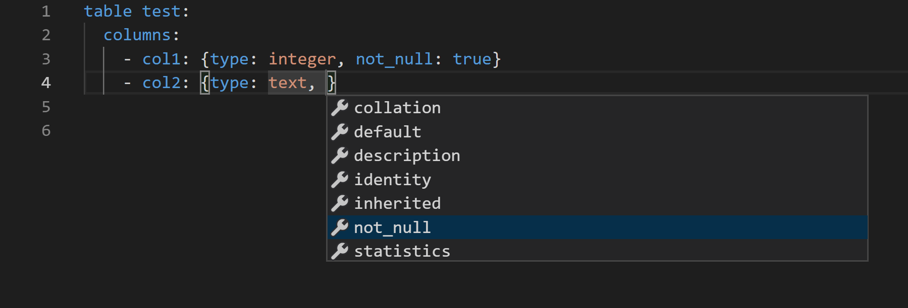
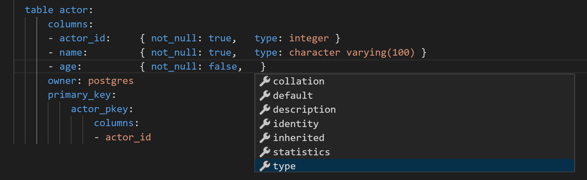

YAML Based Development
======================

With this approach, developers edit the YAML directly with the help of a JSON schema for intellisense.

Setup
-----

You can use any editor, but the setup below uses Visual Studio Code as an example.

After installing Visual Studio Code, install the following extension:

* YAML Support by Red Hat

In your project folder, edit (or create) the file .vscode/settings.json with the following contents::

    {
        "yaml.schemas": {
            "./pyrseas-0.8.json": [
                "*.yaml"
            ]
        }
    }

Sample Process
--------------

Next create the \*.yaml files that define the database.  Create the my_db.yaml file in this folder structure::

    Workspace
    ├── .vscode
    │   └── settings.json
    └── my_db.yaml

And give my_db.yaml the following contents (multiple files can be used too, see :doc:`../advanced/multiple-files`)::

    extension plpgsql:
        description: PL/pgSQL procedural language
        owner: postgres
        schema: pg_catalog
        version: '1.0'
    schema public:
        description: standard public schema
        owner: postgres
        privileges:
        - PUBLIC:
            - all
        - postgres:
            - all
        table actor:
            columns:
            - actor_id:     { not_null: true,   type: integer }
            - name:         { not_null: true,   type: character varying(100) }
            owner: postgres
            primary_key:
                actor_pkey:
                    columns:
                    - actor_id

In Postgres, run::

    CREATE DATABASE pyrseas_yaml_sample;

run yamltodb::

    $ yamltodb -U postgres -W -u pyrseas_yaml_sample my_db.yaml
    Password:
    BEGIN;
    CREATE TABLE actor (
        actor_id integer NOT NULL,
        name character varying(100) NOT NULL);

    ALTER TABLE actor OWNER TO postgres;

    ALTER TABLE actor ADD CONSTRAINT actor_pkey PRIMARY KEY (actor_id);

    COMMIT;
    Changes applied

Add a new column.  As you are typing the new column, you should see intellisense suggesting 
properties of the column, like type and not_null.

The file might looks like this

.. code-block:: YAML
  :emphasize-lines: 18

    extension plpgsql:
        description: PL/pgSQL procedural language
        owner: postgres
        schema: pg_catalog
        version: '1.0'
    schema public:
        description: standard public schema
        owner: postgres
        privileges:
        - PUBLIC:
            - all
        - postgres:
            - all
        table actor:
            columns:
            - actor_id:     { not_null: true,   type: integer }
            - name:         { not_null: true,   type: character varying(100) }
            - age:          { not_null: false,  type: integer }
            owner: postgres
            primary_key:
                actor_pkey:
                    columns:
                    - actor_id

Run yamltodb again::

    $ yamltodb -U postgres -W -u pyrseas_yaml_sample my_db.yaml
    Password:
    BEGIN;
    ALTER TABLE actor
        ADD COLUMN age integer;

    COMMIT;
    Changes applied
